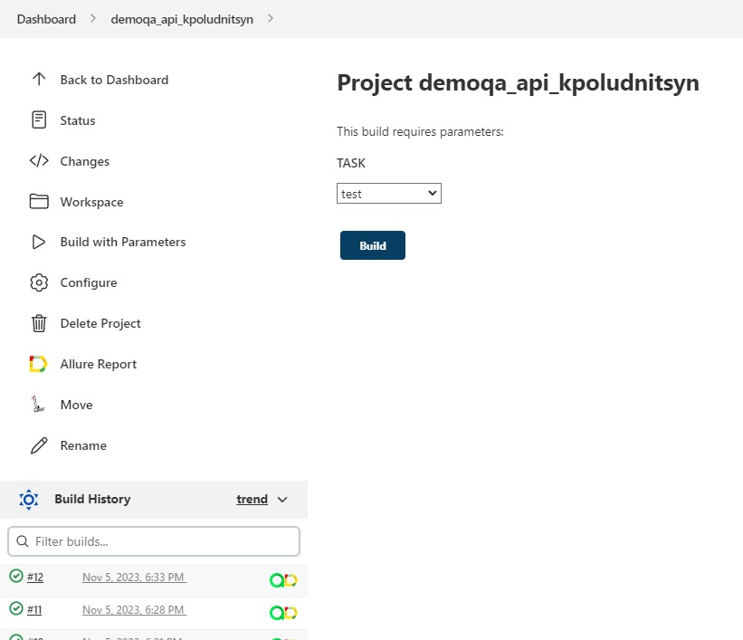
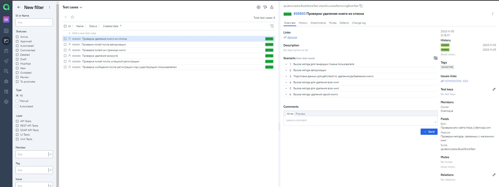

# Проект по автоматизации API методов для сайта [DemoQA](https://demoqa.com)
<p align="center"><a href="https://demoqa.com"></a></p>  

> DemoQA — демонстрационный сайт для инженеров по контролю качества, созданный компанией Tools QA.
>
> Состоит из веб-сайта с учебными формами и примера книжного магазина с открытым API.

## :notebook: Содержание:

- [Стек технологий](#computer-стек-технологий)
- [Тестовые сценарии](#clipboard-тестовые-сценарии)
- [Сборка в Jenkins](#-сборка-в-jenkins)
- [Команда для запуска](#rocket-команда-для-запуска)
- [Allure отчет](#-allure-отчет)
- [Интеграция с Allure TestOps](#-интеграция-с-allure-testops)
- [Интеграция с Jira](#-интеграция-с-jira)
- [Уведомления в Telegram чат с ботом](#-уведомления-в-telegram-чат-с-ботом)

---

## :computer: Стек технологий
<p align="center">
<a href="https://www.java.com/"></a>
<a href="https://www.jetbrains.com/idea/"></a>
<a href="https://www.github.com/"></a>
<a href="https://rest-assured.io/"></a>
<a href="https://www.gradle.org/"></a>
<a href="https://www.junit.org/junit5/"></a>
<a href="https://www.selenide.org/"></a>
<a href="https://www.jenkins.io/"></a>
<a href="https://github.com/allure-framework/allure2"></a>
<a href="https://www.qameta.io/"></a>
<a href="https://www.atlassian.com/software/jira"></a>
<a href="https://www.telegram.org/"></a>
</p>

---

## :clipboard: Тестовые сценарии

- :white_check_mark: Аккаунт
    - :heavy_check_mark: Проверка удаления аккаунта
- :white_check_mark: Авторизация/Регистрация
    - :heavy_check_mark: Проверка полей после авторизации
    - :heavy_check_mark: Проверка полей после успешной регистрации
    - :heavy_check_mark: Проверка сообщения после регистрации под существующим пользователем
- :white_check_mark: Книжный магазин
    - :heavy_check_mark: Проверка удаления книги из списка
    - :heavy_check_mark: Проверка полей на странице книги

---

##  Сборка в [Jenkins](https://jenkins.autotests.cloud/job/demoqa_api_kpoludnitsyn/)

<p align="center">

</p>

### Параметры сборки проекта

| Параметр        | Назначение                               |
|-----------------|------------------------------------------|
| TASK            | Опция выбора запуска определённых тестов |

### Запуск тестов с параметрами в **Jenkins**

<p align="center">

</p>

---

## :rocket: Команда для запуска

```bash
clean
${TASK}
```

### Варианты запуска тестов

Для запуска можно выбрать один из четырёх тест-сьютов:


---

##  [Allure](https://jenkins.autotests.cloud/job/demoqa_api_kpoludnitsyn/allure/) отчет

### Главная страница отчета

<p align="center">

</p>

### Тест-кейсы

<p align="center">

</p>

#### Содержание тест-кейсов

- :heavy_check_mark: Подробное описание шагов
- :heavy_check_mark: Тег
- :heavy_check_mark: Эпик
- :heavy_check_mark: Критичность теста
- :heavy_check_mark: Автор
- :heavy_check_mark: Отдельный запрос
- :heavy_check_mark: Статус код ответа

### Графики

<p align="center">

</p>

---

##  Интеграция с [Allure TestOps](https://allure.autotests.cloud/project/3754/dashboards)

### Dashboard

<p align="center">

</p>

### Автоматизированные тест-кейсы

<p align="center">

</p>

### Запуск сборки из **Allure TestOps**

<p align="center">

</p>

---

##  Интеграция с [Jira](https://jira.autotests.cloud/browse/HOMEWORK-932)

### Задача в Jira

<p align="center">

</p>

#### Содержание задачи

- :heavy_check_mark: Тест-кейсы из Allure TestOps
- :heavy_check_mark: Результат прогона тестов в Allure TestOps

---

##  Уведомления в Telegram чат с ботом

### Уведомление через чат бот

<p align="center">

</p>


#### Содержание уведомления в Telegram

- :heavy_check_mark: Окружение
- :heavy_check_mark: Комментарий
- :heavy_check_mark: Длительность прохождения тестов
- :heavy_check_mark: Общее количество сценариев
- :heavy_check_mark: Процент прохождения тестов
- :heavy_check_mark: Ссылка на Allure отчет